# 🔐 Güvenli Şifreleme Sistemleri

AES  algoritmalarını kullanan bir şifreleme uygulaması.


## 🚀 Başlatma

```bash
pip install flask pycryptodome
python app.py
```

💡 Tarayıcıdan erişim:
http://127.0.0.1:5000


## 🖼️ Ana Sayfa Görseli


Yukarıdaki görsel, uygulamanın ana sayfasını göstermektedir. Bu sayfada kullanıcılar için üç ana işlev sunulmaktadır:

1. **🖋️ Metin Şifreleme / Çözme (AES)**
   Kullanıcı, metin girişi yaparak AES algoritması ile şifreleme veya çözme işlemleri gerçekleştirebilir.

2. **📄 SHA256 Özet**
   Girilen veriden SHA256 hash değeri üretir. Özellikle veri bütünlüğü sağlamak için kullanılabilir.

3. **💾 Dosya Şifreleme / Çözme**
   Kullanıcı bir `.txt` dosyası yükleyerek şifreleyebilir veya daha önce şifrelenmiş bir dosyanın çözümünü gerçekleştirebilir.

Ayrıca sayfanın üst kısmında başlık olarak **“Güvenli Şifreleme”** ifadesi ve altında kısa bir açıklama yer almaktadır:
> “Kendine özel, güvenli ve şık bir şifreleme deneyimi.”

## 🧪 Metin Şifreleme – Kullanım Örneği


Bu sayfa, kullanıcıların metinleri AES (Advanced Encryption Standard) algoritması kullanarak şifrelemesine ve çözmesine olanak tanır.

### 🧾 Bileşenler:

- **Metin:**
  Şifrelenmek veya çözülmek istenen düz metin burada girilir.

- **Şifreleme Anahtarı:**
  AES algoritması için gerekli olan anahtar girilir.
  Not: Anahtar 16 karakter uzunluğunda olmalıdır.

- **Şifrele / Çöz Butonları:**
  - 🔒 **Şifrele:** Girilen metni AES kullanarak şifreler.
  - 🔓 **Çöz:** Şifrelenmiş veriyi ve doğru anahtarı kullanarak orijinal haline döndürür.

- **⬅️ Ana Sayfa Butonu:**
  Kullanıcıyı uygulamanın ana sayfasına yönlendirir.

---

Bu sayfa, hızlı ve güvenli metin şifreleme/çözme işlemleri için özel olarak tasarlanmıştır.
## 🔐 Metin Şifreleme (AES)

Bu bölümde kullanıcı, AES algoritması ile metin şifreleme ve çözme işlemlerini gerçekleştirebilir.

### 🖼️ Arayüz ve Kullanım

#### 1. Giriş Ekranı
Kullanıcıdan şifrelemek istediği metin ve şifreleme anahtarı istenir.


---

#### 2. Veri Girişi
Örneğin kullanıcı `"Suad Wajaheddin"` metnini `"2"` anahtarıyla şifrelemek istiyor:

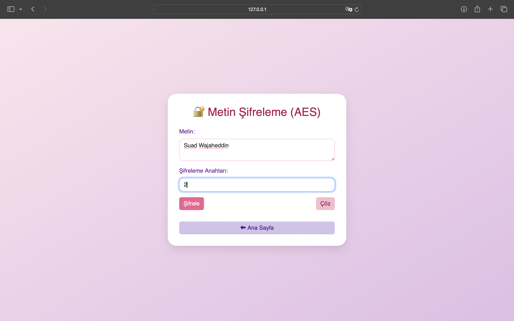

---

#### 3. Sonuç Gösterimi
"Şifrele" butonuna tıkladıktan sonra, şifrelenmiş veri aşağıdaki gibi görüntülenir:

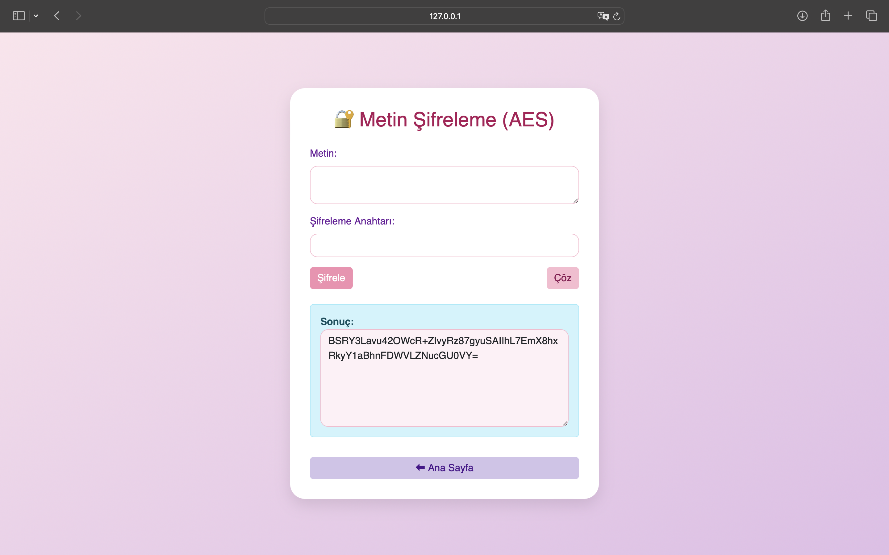

---

### 📌 Açıklamalar

- **Metin:** Şifrelemek veya çözmek istediğiniz içeriği girin.
- **Şifreleme Anahtarı:** 16 karaktere kadar olan anahtar, AES-128 için kullanılır.
- **Şifrele Butonu:** Metni AES ile şifreler.
- **Çöz Butonu:** Şifreli metni anahtar yardımıyla çözer.
- **Sonuç Kutusu:** Şifrelenmiş (veya çözülmüş) metin burada görüntülenir.

Kullanıcı dostu arayüzü sayesinde hızlı ve güvenli şifreleme/çözme işlemleri yapılabilir.


## 💾 Dosya Şifreleme / Çözme (AES)

Kullanıcıların `.txt`, `.pdf` veya benzeri dosyaları AES algoritması ile şifreleyip çözebileceği bir arayüzdür.

### 🖼️ Kullanım Adımları

#### 1. Dosya Seçimi ve Anahtar Girişi

Kullanıcı şifrelemek istediği dosyayı seçer ve bir anahtar girer.

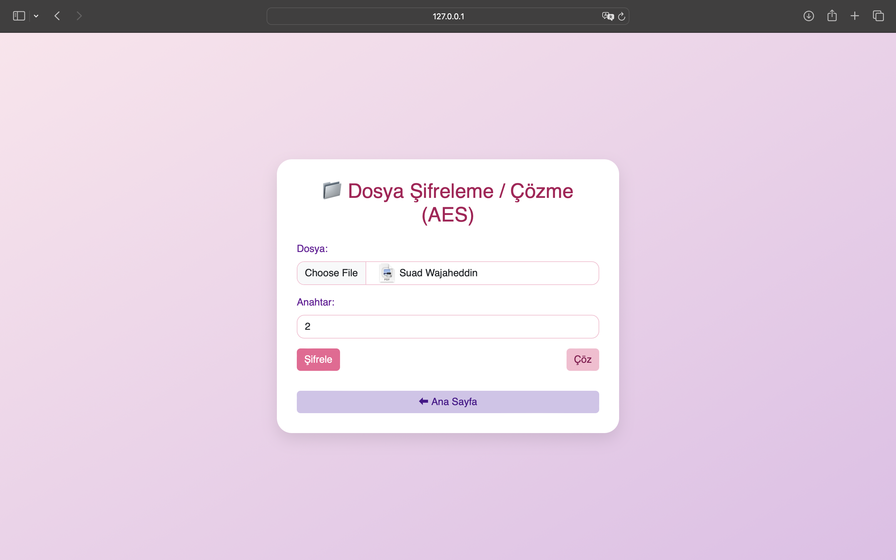

---

#### 2. Başarılı Şifreleme ve İndirme

Şifreleme başarılı olduktan sonra kullanıcıya dosyayı indirme seçeneği sunulur.

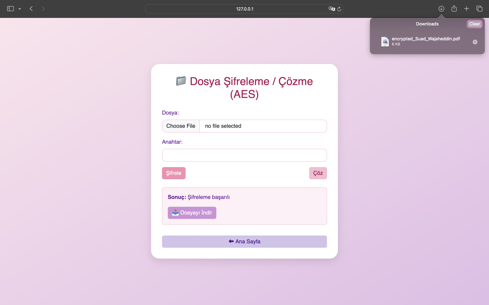

---

### 📝 Açıklamalar

- **Dosya:** `.txt`, `.pdf`, `.docx` gibi dosyalar seçilebilir.
- **Anahtar:** AES algoritması için gerekli şifreleme anahtarıdır (16 karaktere kadar).
- **Şifrele / Çöz Butonları:**
  - `Şifrele`: Seçilen dosyayı şifreler.
  - `Çöz`: Daha önce şifrelenmiş dosyayı orijinal haline getirir.
- **İndirme:** Şifreleme sonrası oluşan dosya indirilebilir.

Bu modül sayesinde dosya bazlı şifreleme işlemleri güvenli ve kolay bir şekilde gerçekleştirilir.

## 🔓 Dosya Çözme (AES)

Uygulama, daha önce AES algoritması ile şifrelenmiş bir dosyanın çözülmesine (orijinal haline getirilmesine) olanak tanır.

### 🖼️ Kullanım Adımları

#### 1. Dosya Seçimi (Şifreli Dosya)

Kullanıcı, çözmek istediği `.pdf` gibi bir dosyayı seçer. Örneğin: `encrypted_Suad_Wajaheddin.pdf`

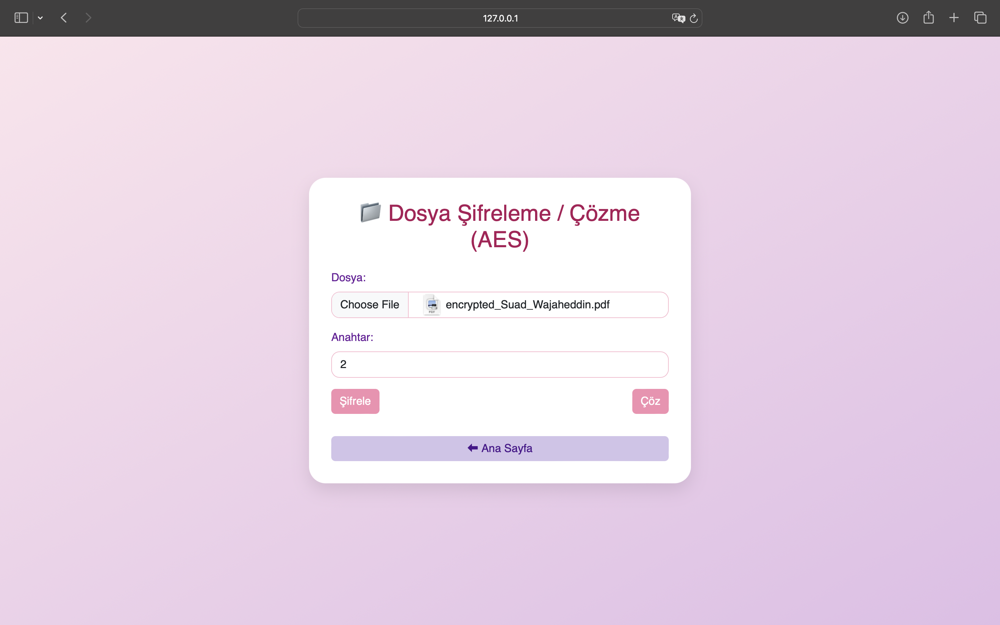

---

#### 2. Dosya Yükleme Penceresi

Bu pencere ile kullanıcı bilgisayarından dosyayı seçip yükler.

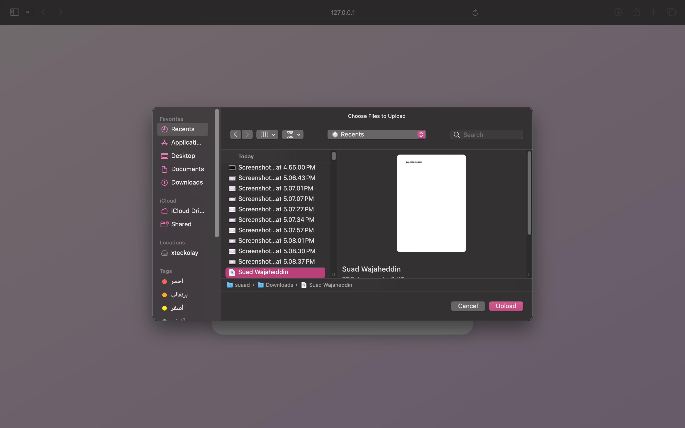

---

#### 3. Başarılı Çözüm ve Dosya İndirme

Çözüm tamamlandığında sistem, `"Çözme başarılı"` mesajı gösterir ve çözülen dosyayı indirmenizi sağlar.

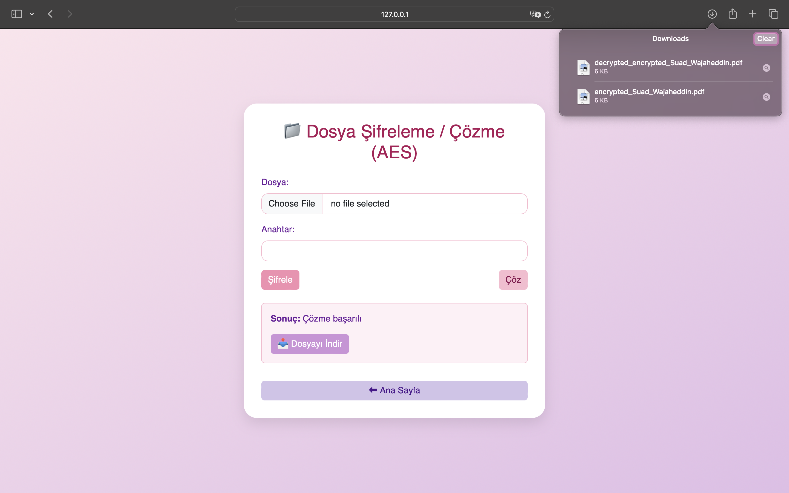

---

### 📌 Açıklamalar

- **Dosya:** `.pdf`, `.txt`, vb. daha önce AES ile şifrelenmiş dosyayı seçin.
- **Anahtar:** Dosya şifrelenirken kullanılan aynı anahtar girilmelidir.
- **Çöz Butonu:** Şifrelenmiş içeriği çözüp orijinal dosyayı oluşturur.
- **İndirme:** Başarılı işlem sonrası çözülen dosya indirilebilir (örn: `decrypted_...`).

Bu özellik, özellikle hassas belgelerin şifreli aktarımı ve ardından güvenli açılımı için kullanışlıdır.

## 🔍 SHA-256 Hash Hesaplama

Bu sayfa, kullanıcıların metin veya dosya üzerinden **SHA256 hash değeri** üretmesini sağlar.

---

### 🧾 Özellikler:

- Hem düz metin hem de dosyalar için SHA-256 hash desteği
- Anında sonuç gösterimi
- Kullanımı kolay arayüz

---

### 🖼️ Kullanım Adımları

#### 1. Metin ile Hash Üretme

Kullanıcı, bir metin girerek `Metin Hash` butonuna tıklar.

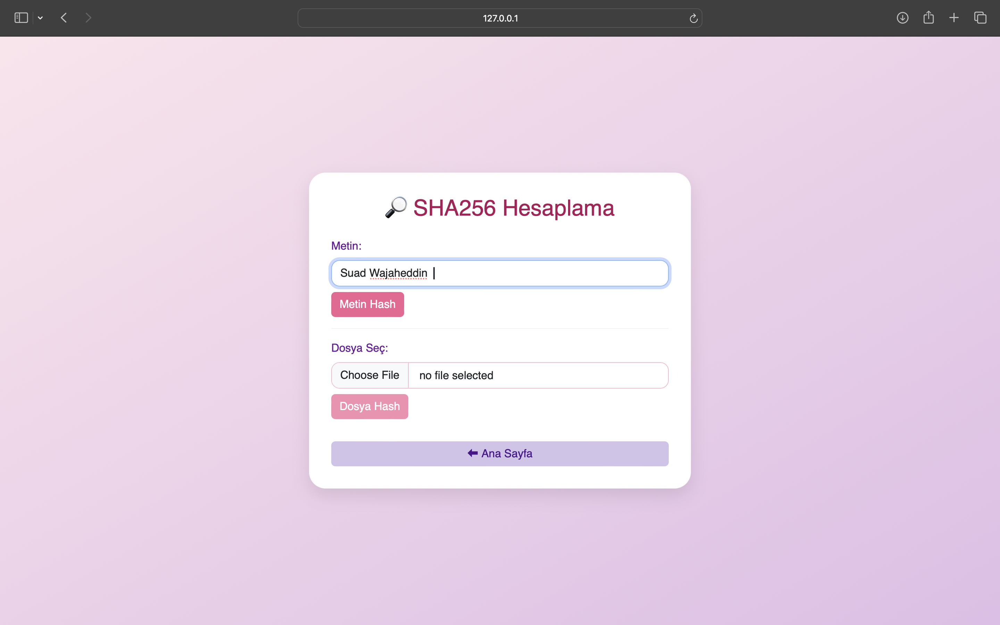

---

#### 2. Sonuç Gösterimi

SHA-256 algoritması ile üretilen hash değeri aşağıda görüntülenir.

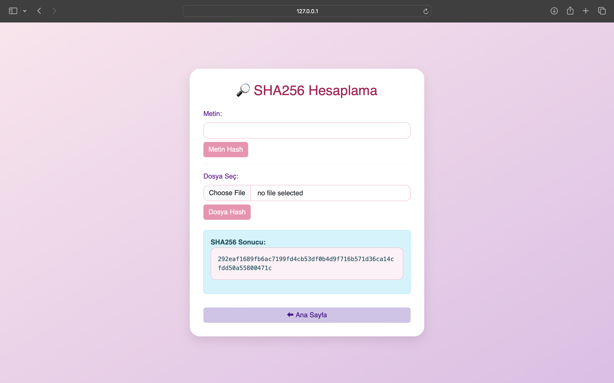

---

#### 3. Dosya Hash Hesaplama

Kullanıcı bir dosya seçerek `Dosya Hash` butonuna tıklar.

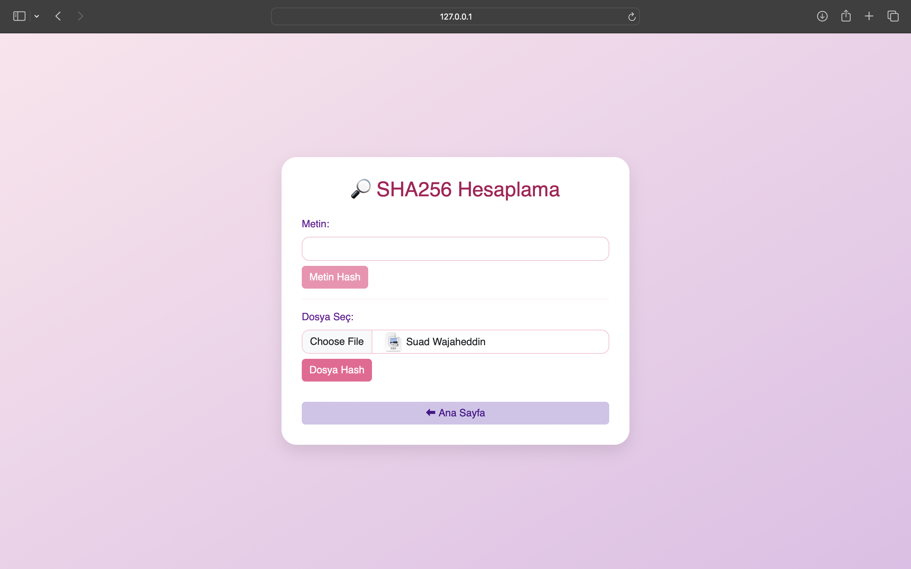

---

#### 4. Dosya Hash Sonucu

Sistem dosyanın SHA-256 özetini hesaplayıp kullanıcıya gösterir.

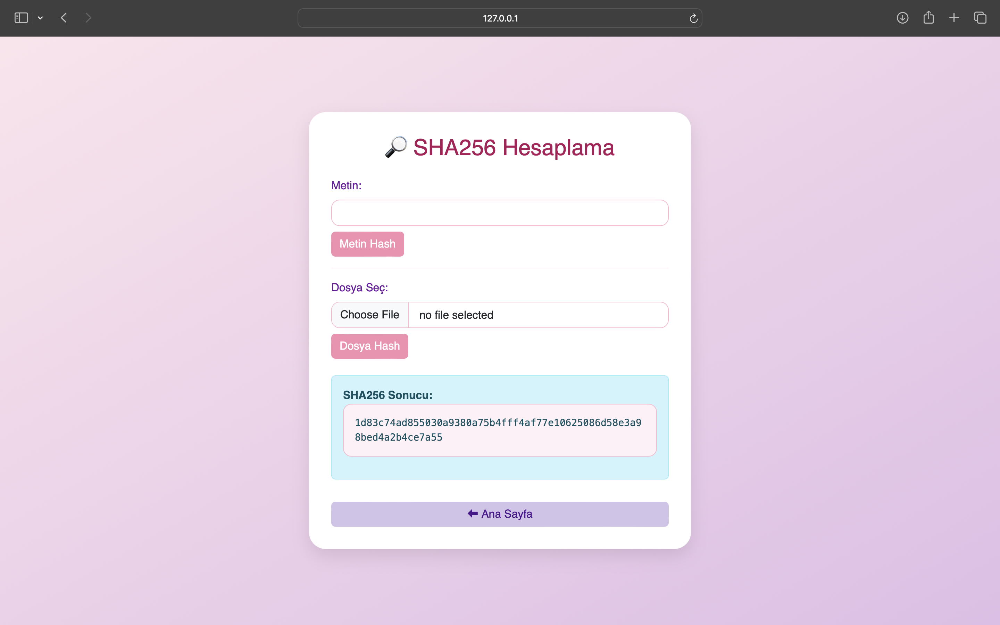

---

### ℹ️ Not:

- SHA-256 bir **tek yönlü hash algoritmasıdır**, yani şifre çözme mümkün değildir.
- Bu sayfa genellikle veri bütünlüğü doğrulama veya dijital imzalar için kullanılır.

## 👨‍💻 Geliştirici

Suad Wajaheddin


